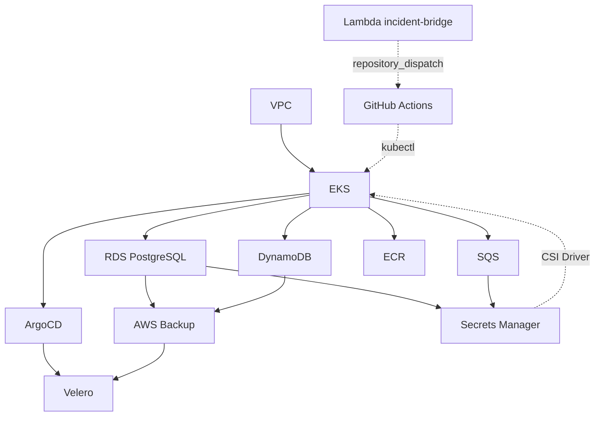

# 🚀 SolidaryTech — IaC Terraform (Hackathon Fase 5)

[](https://www.terraform.io/)
[](https://aws.amazon.com/)

> ⚠️ **PROJETO DIDÁTICO** - Este projeto foi desenvolvido como parte do Hackathon da Fase 5 da Pós-Tech FIAP em Arquitetura Cloud e DevOps.

## 📋 Sobre o Projeto
Este repositório representa o escopo de infraestrutura como código do Hackathon Fase 5 — provisiona toda a infraestrutura AWS da plataforma **SolidaryTech** (ONGs, doações, voluntários) via Terraform, com automação local em `scripts/`+`Makefile` e execução via GitHub Actions.

## Escopo

Este repositório contém a definição da infraestrutura AWS utilizando Terraform, mais os componentes de automação (scripts/CI) e de ITSM/AIOps (self-healing de incidentes, `aiops/`) que dependem diretamente dela. O código está organizado em módulos para provisionar recursos de rede, computação, banco de dados, mensageria, registry de imagens, banco NoSQL, GitOps e Disaster Recovery.

Não fazem parte do escopo deste README:

- Código de aplicação dos 3 microsserviços ([`fiap-tech-challenge-fase-5-services`](https://github.com/nascied/fiap-tech-challenge-fase-5-services)).
- Manifestos Kubernetes/Helm e Applications do ArgoCD ([`fiap-tech-challenge-fase-5-gitops`](https://github.com/nascied/fiap-tech-challenge-fase-5-gitops)).
- Stack de observabilidade (Prometheus/Grafana/Loki/OTel) ([`fiap-tech-challenge-fase-5-observability`](https://github.com/nascied/fiap-tech-challenge-fase-5-observability)).

### 📊 Diagrama da Arquitetura



Diagrama de dependência entre módulos (não um diagrama de rede) — o `DRP.md` tem um diagrama de fluxo de backup/restore mais detalhado.

## 🛠️ Tecnologias Utilizadas

- **Orquestração:** Kubernetes (AWS EKS)
- **Containerização:** Docker com multi-stage builds
- **Banco de Dados:** PostgreSQL (AWS RDS), DynamoDB
- **Mensageria:** AWS SQS
- **Load Balancer:** Nginx Ingress Controller (instalado via ArgoCD, repo `gitops`)
- **Serverless:** AWS Lambda (ponte PagerDuty → GitHub Actions, ver `aiops/`)


## Recursos Provisionados

| Módulo | Serviço AWS | Responsabilidade |
|--------|-------------|------------------|
| `vpc` | VPC | Rede, subnets públicas, subnets privadas, rotas, Internet Gateway, NAT Gateway e Elastic IP |
| `eks` | EKS | Cluster Kubernetes gerenciado |
| `ecr` | ECR | Repositório para imagens Docker |
| `rds` | RDS PostgreSQL | Banco de dados relacional |
| `sqs` | SQS | Fila de mensageria |
| `dynamodb` | DynamoDB | Tabela NoSQL |
| `argocd` | EKS (Helm) | GitOps — instala o ArgoCD no cluster |
| `backup` | AWS Backup, SNS, S3 | Disaster Recovery — backup de RDS/DynamoDB e bucket de destino do Velero |
| `velero` | EKS (Helm) | Disaster Recovery — backup/restore de manifests e volumes do cluster |

> O módulo `modules/redis` (ElastiCache) existe no repositório mas **não é mais instanciado** em `main.tf` — nenhum dos 3 microsserviços usa Redis. Removido por FinOps (economia de ~US$ 12,41/mês), ver [`docs/finops/FORECAST.md`](docs/finops/FORECAST.md). Código preservado caso um serviço futuro precise de cache.

## 🏷️ Estratégia de Tags

Requisito explícito do Hackathon Fase 5 (seção *FinOps: Otimização Financeira e Tagueamento*): *"implemente uma política de tags rigorosa diretamente no seu código Terraform. Todos os recursos de nuvem devem conter tags obrigatórias como `Project=SolidaryTech`, `Environment=Production` e `CostCenter=NGO-Core`"*.

A política tem duas camadas: **tags globais**, aplicadas automaticamente em todo recurso via `default_tags` do provider (garante 100% de cobertura, sem depender de lembrar de tagear cada `resource` manualmente); e **tags específicas**, aplicadas só onde fazem sentido (dado, fila) por não existir um "dono" único para recursos de plataforma compartilhada (VPC, EKS, ArgoCD).

### Tags globais (`provider.tf` → `default_tags`)

| Tag | Valor | Por que existe |
|---|---|---|
| `Project` | `SolidaryTech` | Exigência literal do enunciado. Agrupa todo o custo do projeto no Cost Explorer/Billing num único filtro, independente de qual módulo Terraform gerou o recurso — é a tag que sustenta o "Relatório de Forecast" pedido na entrega. |
| `Environment` | `Development` (dev) / `Production` (prd) — variável `environment` | Exigência literal do enunciado. Separa custo e risco entre os dois ambientes (`terraform.dev.tfvars` / `terraform.prd.tfvars`); permite políticas diferentes por ambiente (ex.: alerta de orçamento mais agressivo em `Production`). |
| `CostCenter` | `NGO-Core` | Exigência literal do enunciado. No relatório de FinOps, mapeia o custo de infraestrutura para o centro de custo do *negócio* (a operação da ONG), não para um time técnico — é a granularidade que a diretoria da SolidaryTech pediu, não a que é mais conveniente para o time de engenharia. |
| `ManagedBy` | `Terraform` | Convenção padrão de IaC (substituiu a tag anterior `created_by`, com o mesmo objetivo). Sinaliza no console que o recurso não deve ser editado manualmente — qualquer alteração fora do Terraform vira drift detectável. |

### Tags específicas por recurso

| Tag | Onde é aplicada | Valor | Por que existe |
|---|---|---|---|
| `Service` | RDS (`donation-service`/`ngo-service`), DynamoDB, SQS, ECR (um valor por repositório) | nome do microsserviço dono do recurso | `Project` sozinho não permite responder "quanto custa rodar o `donation-service`?" — `Service` dá a granularidade por microsserviço no Cost Explorer, sem precisar de um recurso AWS por serviço isolado numa conta separada. |
| `Tier` | RDS, DynamoDB, SQS | `0` (crítico) ou `1` (essencial) | Espelha a classificação de criticidade do [DRP](docs/drp/DRP.md#3-classificação-de-criticidade): `donation-service` é o "Caminho Crítico / Hot Path" do hackathon → Tier 0. Cruza custo com criticidade — justifica gastar mais (ex.: retenção de backup maior) exatamente nos recursos que o negócio definiu como prioritários, em vez de aplicar a mesma política em tudo por preguiça operacional. |
| `Backup` | RDS, DynamoDB | `true` | Não é uma tag de FinOps, é operacional: é a chave que o `aws_backup_selection` do [`module.backup`](iac/terraform/modules/backup) usa para decidir o que entra no plano de backup diário — ver [DRP.md](docs/drp/DRP.md). Documentada aqui porque também é uma tag estruturada do projeto, só que a serviço de Disaster Recovery em vez de custo. |

### O que significa o valor da tag `Tier`

`Tier` não é um conceito da AWS nem um termo padrão de mercado — é uma classificação de criticidade criada especificamente para este projeto, documentada em detalhe no [DRP.md](docs/drp/DRP.md#3-classificação-de-criticidade), e reaproveitada aqui como tag para cruzar custo com criticidade.

| Tier | O quê | Por quê |
|---|---|---|
| **0 — Crítico** | `donation-service` (RDS `donation_db`, fila SQS `solidary-donations`) | O próprio enunciado do hackathon chama o `donation-service` de "Caminho Crítico / Hot Path" — é onde a doação em si é processada. Se isso cair, a plataforma para de cumprir sua função. |
| **1 — Essencial** | `ngo-service` (RDS `ngo_db`), `volunteer-service` (DynamoDB) | Importantes, mas uma indisponibilidade pontual não impede uma doação que já está em andamento — dá para cadastrar uma ONG ou um voluntário depois; não dá para "recuperar" uma doação perdida no meio do processamento. |

Onde isso é usado na prática:

1. **No DRP** — define RTO/RPO diferentes por tier (Tier 0 tem meta de restore mais agressiva) e é o motivo de o `donation-service` ter fila SQS dedicada com prioridade no runbook de restore.
2. **Na tag `Tier`** — permite filtrar no Cost Explorer "quanto custa manter o Tier 0 no ar" separado do resto, insumo direto para o Relatório de Forecast pedido na entrega.

Só existem os tiers 0 e 1 porque só há dois níveis de criticidade entre os três microsserviços — não há um "Tier 2" definido.

**Por que `Service`/`Tier` não estão em todo recurso** (VPC, EKS, ArgoCD, `module.backup`, `module.velero`): esses recursos são infraestrutura compartilhada por todos os três microsserviços — não existe um "dono" único de subrede ou de cluster. Forçar um valor aí (ex.: `Service=platform`) não geraria nenhuma decisão de FinOps nova além do que `Project`/`CostCenter` já dão; por isso a tag só aparece onde de fato divide o custo por serviço/criticidade.

## 💰 Relatório de Forecast

Projeção de custo mensal da arquitetura provisionada por este Terraform, com recomendações de otimização — documento completo em [`docs/finops/FORECAST.md`](docs/finops/FORECAST.md).

| | |
|---|---|
| **Total estimado** | ≈ US$ 238,00/mês (preço de lista on-demand, `us-east-1`) |
| **Maior contribuinte** | Cluster EKS (control plane + nodes + EBS) — ~71% do total |
| **✅ Já aplicado** | ElastiCache Redis removido do provisionamento (não utilizado por nenhum dos 3 microsserviços) — economia de US$ 12,41/mês |
| **Otimização proposta** | Cluster Autoscaler no node group do EKS (hoje fixo em 3 nodes `t3.medium`) — economia potencial de até US$ 60/mês |

## 📁 Estrutura do Projeto

```text
.
├── README.md                       # este arquivo
├── Makefile                        # atalhos pra scripts/ (make plan/apply/... ENV=dev|prd)
├── .github/workflows/
│   ├── terraform.yml                # esteira de Terraform (plan/apply/destroy)
│   └── incident-response.yml        # self-healing (disparado pela Lambda-ponte, ver aiops/)
├── scripts/                         # automação do ciclo de vida do Terraform, passo a passo
│   ├── 00-check-session.sh … 08-destroy.sh
│   ├── run-all.sh
│   └── README.md
├── aiops/                           # ITSM/AIOps: agente Claude de self-healing de incidentes
│   ├── incident_response.py
│   ├── fixtures/sample_incident.json
│   └── README.md
├── docs/
│   ├── drp/                         # Disaster Recovery Plan (DRP.md + runbooks/ + drills/)
│   └── finops/FORECAST.md
└── iac/terraform/
    ├── backends/                    # dev.tfbackend, prd.tfbackend
    ├── bootstrap-backend/           # cria o bucket S3 do state remoto (chicken-and-egg)
    ├── modules/
    │   ├── argocd/                   # Helm — instala o ArgoCD no cluster
    │   ├── backup/                   # AWS Backup + bucket S3 pro Velero
    │   ├── dynamodb/
    │   ├── ecr/
    │   ├── eks/
    │   ├── lambda/                   # ponte PagerDuty -> GitHub Actions (self-healing)
    │   ├── rds/
    │   ├── redis/                    # existe, não instanciado em main.tf (ver nota acima)
    │   ├── secretsmanager/           # secrets consumidos via CSI Driver no cluster
    │   ├── sqs/
    │   ├── velero/                   # Helm — backup/restore de manifests e volumes
    │   └── vpc/
    ├── iac.tftest.hcl
    ├── main.tf / variable.tf / output.tf / provider.tf / required.tf
    ├── terraform.dev.tfvars / terraform.prd.tfvars
    └── README.md                    # gerado por terraform-docs (requirements/providers/modules)
```

## Requisitos

- Terraform instalado.
- AWS CLI instalado e configurado.
- Credenciais AWS com permissão para criar os recursos definidos nos módulos.
- Provider AWS `6.44.0`.

Configure as credenciais AWS antes da execução:

```bash
aws configure
```

Ou utilize variáveis de ambiente:

```bash
export AWS_ACCESS_KEY_ID="sua-access-key"
export AWS_SECRET_ACCESS_KEY="sua-secret-key"
export AWS_SESSION_TOKEN="seu-session-token"
export AWS_DEFAULT_REGION="us-east-1"
```

> A variável `AWS_SESSION_TOKEN` é necessária quando forem utilizadas credenciais temporárias da AWS, como sessões STS, SSO ou credenciais geradas por laboratório.

## Variáveis

Lista completa em `iac/terraform/variable.tf`.

| Variável | Tipo | Sensível | Descrição |
|----------|------|:---:|-----------|
| `aws_vpc` | `object` | | Configuração da VPC, subnets públicas, subnets privadas e tabelas de rota |
| `rds` | `object` | ✅ | Instâncias RDS PostgreSQL (`name`/`db_name`/`db_user` por instância — senha é gerada por `random_password.this`, não é campo desta variável) |
| `aws_sqs_queue_name` | `string` | | Nome da fila SQS |
| `aws_dynamodb_table_name` | `string` | | Nome da tabela DynamoDB |
| `aws_eks_cluster_version` | `string` | | Versão do cluster EKS |
| `aws_region` | `string` | | Região AWS (default `us-east-1`) — usada pelo `module.velero` |
| `environment` | `string` | | `Development` ou `Production` — vira a tag `Environment` em todo recurso (FinOps) |
| `backup_vault_name` / `backup_schedule_cron` / `backup_retention_days` / `backup_notification_email` | — | | Parâmetros do AWS Backup (DRP) — ver `docs/drp/DRP.md` |
| `velero_namespace` / `velero_chart_version` / `velero_bucket_name` / `velero_schedule_cron` / `velero_included_namespaces` | — | | Parâmetros do Velero (DRP) |
| `aws_access_key_id` / `aws_secret_access_key` / `aws_session_token` | `string` | ✅ | Credenciais de sessão da AWS Academy — populam o Secrets Manager pro CSI Driver. **Nunca em `.tfvars`**, passar via `TF_VAR_*` (ver `scripts/README.md`) |
| `github_repo` | `string` | | Repo (`owner/repo`) que recebe o `repository_dispatch` do self-healing (default já aponta pra este repo) |
| `github_token` | `string` | ✅ | Token do GitHub com permissão de `repository_dispatch` — **nunca em `.tfvars`** |
| `pagerduty_webhook_secret` | `string` | ✅ | Secret de verificação de assinatura do webhook V3 do PagerDuty — **nunca em `.tfvars`** |

## Exemplo de `terraform.tfvars`

Este repositório já versiona `terraform.dev.tfvars`/`terraform.prd.tfvars` reais — normalmente não é preciso criar um novo. Trecho representativo do `terraform.dev.tfvars` (valores não sensíveis; senha do RDS é gerada por `random_password.this`, não é campo de `tfvars`):

```hcl
aws_sqs_queue_name      = "solidary-donations"
aws_dynamodb_table_name = "SolidaryTechVolunteers"
aws_eks_cluster_version = "1.35"
aws_region              = "us-east-1"
environment             = "Development"

rds = {
  rds_properties = [
    { name = "donation-service", db_name = "donation_db", db_user = "postgres" },
    { name = "ngo-service", db_name = "ngo_db", db_user = "postgres" }
  ]
}

aws_vpc = {
  name                     = "fiap-tc-f5-vpc"
  cidr_block               = "172.16.0.0/16"
  internet_gateway_name    = "fiap-tc-f5-igw"
  nat_gateway_name         = "fiap-tc-f5-ngw"
  public_route_table_name  = "fiap-tc-f5-public-rt"
  private_route_table_name = "fiap-tc-f5-private-rt"
  public_subnets  = [ /* ver terraform.dev.tfvars completo */ ]
  private_subnets = [ /* ver terraform.dev.tfvars completo */ ]
}
```

As variáveis sensíveis (`aws_access_key_id`/`aws_secret_access_key`/`aws_session_token`, `github_token`, `pagerduty_webhook_secret`) **nunca vão em `.tfvars`** — são resolvidas na hora do `apply` (ver `scripts/README.md` e `iac/terraform/modules/lambda/README.md`).

## Modelo de Uso manual

> **Recomendado**: use os scripts em [`scripts/`](scripts/README.md) (`./scripts/run-all.sh <dev|prd>` ou `make plan/apply ENV=dev`) — cobrem sessão AWS, bootstrap do backend, `fmt`/`validate`/`test`, `plan`, `apply` com confirmação e `kubeconfig`, sem precisar decorar os comandos abaixo. O que segue é a referência manual, passo a passo.

Acesse o diretório Terraform:

```bash
cd iac/terraform
```

Inicialize o Terraform:

```bash
terraform init
```

Valide a configuração:

```bash
terraform validate
```

Formate os arquivos:

```bash
terraform fmt -recursive
```

Gere o plano de execução:

```bash
terraform plan -out=tfplan
```

Aplique a infraestrutura:

```bash
terraform apply tfplan
```

Consulte os outputs:

```bash
terraform output
```

Destrua a infraestrutura quando ela não for mais necessária:

```bash
terraform destroy
```

## Execução via GitHub Actions

Duas esteiras neste repositório: `.github/workflows/terraform.yml` (Terraform — plan/apply/destroy, documentada abaixo) e `.github/workflows/incident-response.yml` (self-healing de incidentes, disparada pela Lambda-ponte via `repository_dispatch` — ver [`aiops/README.md`](aiops/README.md), não coberta aqui).

A esteira de Terraform executa os comandos a partir do diretório `iac/terraform`, mantendo o processo automatizado dentro do escopo de IaC.

### Fluxo recomendado

| Evento | Ação | Objetivo |
|--------|------|----------|
| Pull request | `terraform fmt -check`, `terraform validate`, `tflint`, `checkov` e `terraform plan` | Validar qualidade e segurança antes do merge |
| Push na branch principal | `terraform init`, `terraform plan` e `terraform apply` | Aplicar a infraestrutura aprovada |
| Execução manual | `terraform destroy` | Remover a infraestrutura quando necessário |

### Secrets e variáveis

Configure os seguintes secrets no repositório GitHub em `Settings > Secrets and variables > Actions`:

| Nome | Descrição |
|------|-----------|
| `AWS_ACCESS_KEY_ID` / `AWS_SECRET_ACCESS_KEY` / `AWS_SESSION_TOKEN` | Credenciais de sessão da AWS Academy. Usadas **duas vezes** no workflow: autenticam o provider AWS (`aws-actions/configure-aws-credentials`) **e** populam `var.aws_access_key_id`/`aws_secret_access_key`/`aws_session_token` via `TF_VAR_*` (consumidas por `module.secrets`, não pelo provider) — as duas coisas são independentes, não dá pra assumir que uma cobre a outra. |
| `INCIDENT_BRIDGE_GITHUB_TOKEN` | Token do GitHub (PAT com permissão de `repository_dispatch` neste repo) — popula `var.github_token` via `TF_VAR_github_token`. Usado pelo Lambda-ponte do self-healing em runtime, **não** é o `secrets.GITHUB_TOKEN` padrão do Actions (esse é efêmero, só vale durante a run atual; o Lambda precisa de um token persistente, chamável a qualquer momento pelo PagerDuty). Ver [`iac/terraform/modules/lambda/README.md`](iac/terraform/modules/lambda/README.md). |
| `PAGERDUTY_WEBHOOK_SECRET` | Secret de verificação de assinatura da webhook subscription V3 do PagerDuty — popula `var.pagerduty_webhook_secret` via `TF_VAR_pagerduty_webhook_secret`. Não confundir com `PAGERDUTY_API_TOKEN`/`PAGERDUTY_FROM_EMAIL` (abaixo), que servem pra outra coisa. |

Nenhum desses vai em `.tfvars` — são resolvidos em runtime pelo `env:` do job (`.github/workflows/terraform.yml`), nunca commitados.

O backend remoto (bucket S3, caminho do state por ambiente) **não é secret** — vem dos arquivos já versionados `backends/dev.tfbackend`/`backends/prd.tfbackend` (`terraform init -backend-config="backends/${DEPLOY_ENV}.tfbackend"`), e o `.tfvars` de cada ambiente também já está versionado (`terraform.dev.tfvars`/`terraform.prd.tfvars`) — não é conteúdo de secret. O backend usa lock nativo por arquivo (`use_lockfile = true`), sem tabela DynamoDB de lock.

Secrets adicionais só são necessários pro workflow de self-healing (`incident-response.yml`) — `ANTHROPIC_API_KEY`, `EKS_CLUSTER_NAME`, `INCIDENT_SLACK_WEBHOOK_URL`, `PAGERDUTY_API_TOKEN`/`PAGERDUTY_FROM_EMAIL` — ver [`aiops/README.md`](aiops/README.md).

**Rodando localmente (`scripts/`) em vez da pipeline**: `05-plan.sh`/`06-apply.sh` só resolvem as 3 credenciais AWS automaticamente (via `aws configure export-credentials`, ver `scripts/README.md`). `TF_VAR_github_token` e `TF_VAR_pagerduty_webhook_secret` continuam precisando ser exportados manualmente no shell antes de rodar os scripts — não tem "secret do GitHub" fora da pipeline.

### Exemplo de workflow

Crie o arquivo `.github/workflows/terraform.yml` com os detalhes resumido abaixo.:

Workflow manual (`workflow_dispatch`) para Terraform com `action` (`plan|apply|destroy`).

Ele:
1. Configura AWS, Terraform e TFLint.
2. Detecta a branch e escolhe ambiente:
- `dev` -> `terraform.dev.tfvars`
- `main` -> `terraform.prd.tfvars`
3. Roda validações (`fmt`, `init` com backend por ambiente, `validate`, `tflint`, `terraform test`) e `Checkov`.
4. Executa:
- `plan` (gera `tfplan`)
- `apply` só manual
- `destroy` só manual.


```yaml
name: Terraform IaC

on:
  # pull_request:
  #   branches:
  #     - main
  #   paths:
  #     - "iac/terraform/**"
  # push:
  #   branches:
  #     - dev
  #   paths:
  #     - "iac/terraform/**"
  workflow_dispatch:
    inputs:
      action:
        description: "Ação Terraform"
        required: true
        default: "plan"
        type: choice
        options:
          - plan
          - apply
          - destroy

jobs:
  terraform:
    name: Terraform
    runs-on: ubuntu-latest
    defaults:
      run:
        working-directory: iac/terraform

    env:
      TF_IN_AUTOMATION: true
      TF_INPUT: false
      # Variáveis Terraform sensíveis (var.aws_access_key_id/secret_access_key/
      # session_token, var.github_token, var.pagerduty_webhook_secret em
      # variable.tf) — sem default de propósito, nunca versionadas em .tfvars.
      # TF_VAR_<nome> é o único jeito de popular uma variável Terraform via
      # ambiente; sem isso, plan/apply/destroy falha com "No value for
      # required variable". Isso é diferente (e adicional) ao passo "Configura
      # credenciais AWS" abaixo: aquele só autentica o *provider* AWS via
      # aws-actions/configure-aws-credentials — não popula essas variáveis do
      # Terraform, que são consumidas por module.secrets (Secrets Manager) e
      # module.incident_bridge (Lambda-ponte do self-healing), não pelo
      # provider. Faltavam todas as 5 aqui antes desta correção.
      TF_VAR_aws_access_key_id: ${{ secrets.AWS_ACCESS_KEY_ID }}
      TF_VAR_aws_secret_access_key: ${{ secrets.AWS_SECRET_ACCESS_KEY }}
      TF_VAR_aws_session_token: ${{ secrets.AWS_SESSION_TOKEN }}
      # Token do GitHub (PAT com permissão de repository_dispatch neste repo)
      # usado pelo Lambda-ponte em runtime — não é o secrets.GITHUB_TOKEN
      # padrão do Actions (esse é efêmero, válido só durante esta run; o
      # Lambda precisa de um token persistente pra chamar a API do GitHub a
      # qualquer momento, disparado pelo PagerDuty, fora do contexto de uma
      # run). Ver iac/terraform/modules/lambda/README.md.
      TF_VAR_github_token: ${{ secrets.INCIDENT_BRIDGE_GITHUB_TOKEN }}
      # Secret de verificação de assinatura da webhook subscription V3 do
      # PagerDuty (não confundir com PAGERDUTY_API_TOKEN/PAGERDUTY_FROM_EMAIL,
      # usados pelo incident-response.yml pra outra finalidade — resolver o
      # incidente via REST API).
      TF_VAR_pagerduty_webhook_secret: ${{ secrets.PAGERDUTY_WEBHOOK_SECRET }}

    steps:
      - name: Checkout
        uses: actions/checkout@v4
     
      - name: Configura credenciais AWS
        uses: aws-actions/configure-aws-credentials@v4
        with:
          aws-access-key-id: ${{ secrets.AWS_ACCESS_KEY_ID }}
          aws-secret-access-key: ${{ secrets.AWS_SECRET_ACCESS_KEY }}
          aws-session-token: ${{ secrets.AWS_SESSION_TOKEN }}
          aws-region: ${{ secrets.AWS_REGION }}

      - name: Setup Terraform
        uses: hashicorp/setup-terraform@v3

      - name: Configura TFLint
        uses: terraform-linters/setup-tflint@v4

      - name: Define arquivo tfvars por branch
        run: |
          # pull_request usa GITHUB_BASE_REF (branch de destino do PR)
          # push e workflow_dispatch usam GITHUB_REF_NAME (branch atual)
          if [ "${GITHUB_EVENT_NAME}" = "pull_request" ]; then
            BRANCH="${GITHUB_BASE_REF}"
          else
            BRANCH="${GITHUB_REF_NAME}"
          fi

          echo "Branch detectada: ${BRANCH}"

          case "${BRANCH}" in
            dev)
              ENV="dev"
              ;;
            main)
              ENV="prd"
              ;;
            *)
              echo "❌ Branch não suportada para deploy: ${BRANCH}"
              exit 1
              ;;
          esac

          echo "TF_VARS_FILE=terraform.${ENV}.tfvars" >> "$GITHUB_ENV"
          echo "DEPLOY_ENV=${ENV}" >> "$GITHUB_ENV"

      - name: Mostra arquivo tfvars selecionado
        run: |
          echo "Ambiente: ${DEPLOY_ENV}"
          echo "Arquivo: ${TF_VARS_FILE}"

      - name: Lint Terraform
        run: |
          terraform fmt -check -recursive
          terraform init -upgrade -backend-config="backends/${DEPLOY_ENV}.tfbackend"
          terraform validate
          tflint --init
          tflint --recursive

      - name: Testes unitários
        run: terraform test

      - name: Gera relatório Checkov
        id: checkov
        uses: bridgecrewio/checkov-action@master
        with:
          directory: iac/terraform
          framework: terraform
          output_format: cli,sarif,json
          output_file_path: console,results.sarif,checkov-report.json
          soft_fail: true

      - name: Publica relatório Checkov em tabela
        if: always()
        run: |
          echo "## Relatório Checkov (Terraform) — Ambiente: ${DEPLOY_ENV}" >> "$GITHUB_STEP_SUMMARY"
          echo "" >> "$GITHUB_STEP_SUMMARY"

          if [ -s checkov-report.json ]; then
            FAILED=$(jq '[.results.failed_checks[]?] | length' checkov-report.json 2>/dev/null || echo "0")
            PASSED=$(jq '[.results.passed_checks[]?] | length' checkov-report.json 2>/dev/null || echo "0")

            if [ "${FAILED}" -gt "0" ]; then
              echo "⚠️ **${FAILED} finding(s) encontrado(s) — revisar antes do apply**" >> "$GITHUB_STEP_SUMMARY"
            else
              echo "✅ **Nenhum finding detectado — ${PASSED} checks passaram**" >> "$GITHUB_STEP_SUMMARY"
            fi

            echo "" >> "$GITHUB_STEP_SUMMARY"
            echo "| Status | Check ID | Severidade | Recurso | Arquivo |" >> "$GITHUB_STEP_SUMMARY"
            echo "|---|---|---|---|---|" >> "$GITHUB_STEP_SUMMARY"

            jq -r '
              (.results.failed_checks[]? | [
                "❌ FAILED",
                (.check_id // "-"),
                (.severity // "-"),
                (.resource // "-"),
                (.file_path // "-")
              ]),
              (.results.passed_checks[]? | [
                "✅ PASSED",
                (.check_id // "-"),
                (.severity // "-"),
                (.resource // "-"),
                (.file_path // "-")
              ])
              | @tsv
            ' checkov-report.json 2>/dev/null | \
            while IFS=$'\t' read -r status check_id severity resource file_path; do
              echo "| ${status} | ${check_id} | ${severity} | ${resource} | ${file_path} |" >> "$GITHUB_STEP_SUMMARY"
            done
          else
            echo "⚠️ **Checkov não gerou relatório JSON**" >> "$GITHUB_STEP_SUMMARY"
          fi

      - name: Terraform Plan
        if: >-
          github.event_name == 'pull_request' ||
          github.event_name == 'push' ||
          (github.event_name == 'workflow_dispatch' && (github.event.inputs.action == 'plan' || github.event.inputs.action == 'apply'))
        run: terraform plan -var-file="${TF_VARS_FILE}" -out=tfplan

      - name: Terraform Apply
        # Somente via workflow_dispatch — sem apply automático no push
        if: github.event.inputs.action == 'apply'
        run: terraform apply -auto-approve tfplan

      # Nota: ao contrário do projeto anterior (ToggleMaster/Fase 3), este workflow
      # não despacha outputs (ECR/RDS/Redis) pro repositório de serviços depois do
      # apply. Não é mais necessário: os segredos de app (DATABASE_URL, credenciais
      # AWS, fila SQS) chegam aos pods via AWS Secrets Manager + Secrets Store CSI
      # Driver (ver module.secretsmanager e helm/{donation,volunteer}-service/
      # templates/secretproviderclass.yaml no repo gitops) — nada disso passa por
      # values.yaml nem por este workflow. O único valor que ainda precisa ir do
      # Terraform pro GitOps é a URL de cada repositório ECR pra image.repository,
      # e isso é resolvido dinamicamente pela própria pipeline de CI/CD de cada
      # serviço no momento do push da imagem (aws-actions/amazon-ecr-login), não
      # aqui — ver fiap-tech-challenge-fase-5-services/.github/workflows/ci-*.yaml.

      - name: Terraform Destroy
        # Somente via workflow_dispatch com branch como fonte da verdade do ambiente
        if: github.event.inputs.action == 'destroy'
        run: terraform destroy -var-file="${TF_VARS_FILE}" -auto-approve
```

### Recomendações para a esteira

- Utilizar GitHub Environments com aprovação manual para execuções de `apply` e `destroy`.
- Armazenar o state em backend remoto S3 com lock nativo por arquivo `.tflock`, antes de executar a esteira em ambiente compartilhado.
- Não salvar `terraform.tfvars`, `*.tfstate` ou planos gerados como artefatos públicos.
- Revisar o resultado do `terraform plan` em pull requests antes do merge.
- Executar `destroy` apenas por `workflow_dispatch` e com aprovação manual.

## Outputs

Lista completa em `iac/terraform/output.tf`. Os principais:

| Output | Descrição |
|--------|-----------|
| `vpc_id` / `internet_gateway_id` / `public_subnet_id` / `private_subnet_id` | Rede |
| `aws_db_instance_endpoint` / `aws_db_instance_connection_strings` (sensível) | RDS |
| `aws_eks_cluster_id` / `aws_eks_cluster_name` / `aws_eks_cluster_endpoint` | Cluster EKS — `aws_eks_cluster_name` é o que `scripts/07-update-kubeconfig.sh` usa |
| `aws_ecr_repository_repository_url` | URLs dos 3 repositórios ECR (ngo/donation/volunteer) |
| `sqs_queue_url` / `aws_dynamodb_table_name` | Mensageria e NoSQL |
| `argocd_release_status` | Status do release Helm do ArgoCD |
| `backup_vault_arn` / `velero_bucket_name` / `velero_release_status` | DRP (AWS Backup + Velero) |
| `donation_service_secret_name` / `volunteer_service_secret_name` / `ngo_service_secret_name` | Secrets Manager (CSI Driver) |
| `incident_bridge_function_url` | URL da Lambda-ponte — configurar como destino do webhook V3 no PagerDuty (ver `aiops/README.md`) |

Não existe mais output de ElastiCache/Redis — `module.redis` não é instanciado (ver nota na seção "Recursos Provisionados").

Para consultar outputs sensíveis:

```bash
terraform output -json
```

## Arquivos Ignorados

Os seguintes arquivos e diretórios não devem ser versionados:

```text
**/.terraform/
*.tfstate
*.tfstate.*
*.tfvars
*.tfvars.json
*.tfplan
*.plan
crash.log
override.tf
*_override.tf
```

## Boas Práticas

- Revisar sempre o resultado de `terraform plan` antes do `terraform apply`.
- Não versionar state, planos de execução ou arquivos com variáveis sensíveis.
- Utilizar backend remoto para o state em ambientes compartilhados.
- Proteger senhas e credenciais com AWS Secrets Manager, SSM Parameter Store ou ferramenta equivalente.
- Executar `terraform destroy` em ambientes temporários para evitar custos desnecessários.


## 👨‍💻 Autores

**Edson Leandro da Silva Nascimento**
- Pós-Tech FIAP - Arquitetura Cloud e DevOps
- Hackathon Fase 5

---

## 📄 Licença

Este projeto é apenas para fins educacionais como parte do programa de pós-graduação devops arquitetura Cloud da instituição FIAP.
