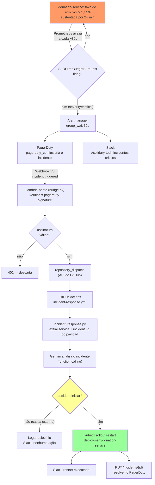

# aiops/ — Self-healing de incidentes (ITSM/AIOps, Requisito 3)

Fecha o ciclo de detecção → resposta automatizada do `docs/itsm-aiops.md`
(repo `fiap-tech-challenge-fase-5-observability`): quando um alerta crítico
vira incidente no PagerDuty, um agente com Gemini decide se um restart do
serviço afetado resolve o sintoma e, se decidir que sim, executa de verdade.

> Era Claude (Anthropic) originalmente — trocado pra Gemini (Google AI
> Studio) numa sessão posterior porque a conta Anthropic ficou sem crédito no
> meio dos testes reais. Troca só na chamada de API (`call_gemini`/`run_agent`
> em `incident_response.py`, via `requests` puro — sem SDK novo); o resto do
> desenho (system prompt, allowlist, tool schema, fluxo) é o mesmo.

## Fluxo completo

Gatilho exato (nada disso precisa de intervenção manual — Prometheus avalia
sozinho a cada ~30s): `SLOErrorBudgetBurnFast` dispara quando a taxa de
respostas 5xx do `donation-service` passa de **1,44% das requisições, por 5
minutos, sustentado por mais 2 minutos contínuos** (`alerting/prometheusrule-slo-burn.yaml`,
repo `observability`). Só `donation-service` está em `severity: critical`
hoje — `ngo-service`/`volunteer-service` têm a mesma regra em `severity:
warning` (só Slack, não aciona o self-healing).



**Confirmado ponta a ponta contra infraestrutura real** numa sessão posterior
(não só desenhado) — ver `CLAUDE.md` do repo pra timeline completa com IDs de
incidente reais.

**Gap real, conhecido, ainda sem fix**: esse fluxo só cobre "serviço de pé
mas respondendo erro" — um pod que **crasha antes de responder** (ex.: falha
de conexão no startup) não gera a métrica de resposta 5xx nenhuma, então
nunca dispara este alerta. Confirmado na prática: 425 restarts do
`donation-service` numa janela de 37h não dispararam nada. Fechar esse gap
exigiria uma regra nova baseada em `kube_pod_container_status_waiting_reason{reason="CrashLoopBackOff"}`
(ou `up == 0`) com `severity: critical`, ainda não implementada.

**Por que uma ponte Lambda e não PagerDuty -> GitHub direto?** O endpoint
`repository_dispatch` do GitHub exige um corpo específico
(`{"event_type": ..., "client_payload": {...}}`) e autenticação via token —
o webhook nativo do PagerDuty não manda esse formato. A ponte só reformata e
repassa; toda a decisão fica no GitHub Action, não na Lambda.

**Por que a ponte roda fora do EKS (Lambda, não um pod no cluster)?** Se o
próprio cluster é o que está com problema, um receptor rodando dentro dele
pode não estar disponível pra receber o webhook. Rodar fora do EKS evita essa
dependência circular.

## Autonomia

Execução **automática em todos os tiers** (decisão do usuário, ver histórico
da sessão) — o script não espera aprovação humana antes de rodar o
`kubectl rollout restart`. O Gemini ainda decide *se* vale a pena reiniciar
(não reinicia cegamente todo incidente); a auditoria de cada decisão fica no
log estruturado (stdout do GitHub Actions) e na mensagem do Slack.

## ✅ Confirmado ao vivo, numa sessão posterior (ambos os pontos abaixo já eram tratados como "não confirmados")

Simulação real (erro de banco genuíno forçado no `donation-service`, não
payload sintético) percorreu a cadeia completa pelo menos uma vez até a
Lambda e o GitHub Actions, e confirmou os 2 pontos que antes só tinham o
"formato mais estabelecido que se conhece" sem validação ao vivo:

1. **Verificação de assinatura do webhook** (`x-pagerduty-signature`,
   `iac/terraform/modules/lambda/src/bridge.py`) — confirmado indiretamente
   mas de forma conclusiva: o GitHub Actions recebeu o `client_payload` com
   `service`/`incident_id` reais extraídos corretamente do payload do
   incidente de verdade — isso só acontece se `_verify_signature()` retornou
   `True` (caso contrário a Lambda responde `401` antes de sequer montar o
   dispatch). Formato assumido (HMAC-SHA256, prefixo `v1=`) está correto.
2. **`extract_service_name`/`extract_incident_id`** (`incident_response.py`)
   — confirmados extraindo corretamente de um payload real do webhook V3, não
   só do fixture sintético.
3. **`resolve_pagerduty_incident()`** (`PUT /incidents/{id}`) — formato
   confirmado à parte, usado com sucesso via `curl` real nesta mesma sessão
   pra resolver incidentes de teste manualmente (200 OK). Ainda não
   confirmado sendo chamado pelo próprio script numa run real (nos testes até
   agora, o incidente sempre se resolveu sozinho via Alertmanager antes do
   agente terminar de decidir — ver `CLAUDE.md` do repo pro detalhe).

**Ainda pendente de confirmação**: o `kubectl rollout restart` sendo
executado de fato por uma run real do GitHub Actions (chegou a ser
bloqueado por: chave Anthropic sem crédito → trocada pro Gemini; erro de
workspace do Gemini → corrigido; ver `CLAUDE.md` pro histórico completo).

## Testar localmente (sem PagerDuty, GitHub Actions ou EKS reais)

```bash
pip install -r aiops/requirements.txt
export GEMINI_API_KEY=AQ...   # gerada em aistudio.google.com/apikey

# dry-run: não executa kubectl nem chama PagerDuty/Slack de verdade
python aiops/incident_response.py \
  --payload-file aiops/fixtures/sample_incident.json \
  --dry-run
```

Isso exercita o fluxo completo (extrai o serviço do payload, chama o Gemini
com function calling, decide, e só *loga* o que faria) — dá pra validar o
comportamento do agente sem precisar de nenhuma infra real. Sem `--dry-run`
(e com um kubeconfig configurado), o restart é executado de verdade.

> **Validado de verdade numa sessão posterior**, chamada real à API
> incluída (não só lógica pura/stub) — os 2 cenários testados contra a API
> real do Gemini: incidente sem causa externa óbvia → decide reiniciar
> (`restart_decided` + `restart_skipped_dry_run` no log); incidente com causa
> externa explícita no payload (RDS parado) → decide **não** reiniciar
> (`action_taken: null`, texto explicando o porquê). Achado real no processo:
> esse modelo (`gemini-flash-latest`, resolveu pra `gemini-3.8-flash` no
> momento do teste) exige ecoar de volta o campo `thoughtSignature` da parte
> `functionCall` na próxima chamada — sem isso, `400 Bad Request` ("Function
> call is missing a thought_signature"). O código já trata isso (reanexa o
> `content` do modelo tal como veio, sem reconstruir a parte manualmente).

## Secrets do GitHub Actions (`.github/workflows/incident-response.yml`)

Além das variáveis que `incident_response.py` lê diretamente (tabela abaixo),
o workflow em si precisa destes Secrets configurados no repositório
(Settings → Secrets and variables → Actions):

| Secret | Uso |
|---|---|
| `AWS_ACCESS_KEY_ID` / `AWS_SECRET_ACCESS_KEY` / `AWS_SESSION_TOKEN` | Sessão AWS Academy — mesma limitação de ~4h documentada em `scripts/README.md`. Precisa estar válida no momento em que o incidente dispara. |
| `EKS_CLUSTER_NAME` | Nome do cluster (`terraform output -raw aws_eks_cluster_name` depois do `apply`) — usado no `aws eks update-kubeconfig`. |
| `GEMINI_API_KEY` | Chamada à API do Gemini (Google AI Studio, tier gratuito). |
| `INCIDENT_SLACK_WEBHOOK_URL` | Notificação do resultado — opcional, workflow segue sem ele. |
| `PAGERDUTY_API_TOKEN` / `PAGERDUTY_FROM_EMAIL` | Resolver o incidente automaticamente — opcional. |

Também é preciso, no repo de infra (Terraform), `var.github_token`/
`var.pagerduty_webhook_secret` de `module.incident_bridge` — resolvidas
automaticamente pela pipeline (`.github/workflows/terraform.yml`) a partir
dos secrets `INCIDENT_BRIDGE_GITHUB_TOKEN`/`PAGERDUTY_WEBHOOK_SECRET` do
repositório; rodando localmente via `scripts/`, precisam ser exportadas
manualmente como `TF_VAR_github_token`/`TF_VAR_pagerduty_webhook_secret` antes
do `apply` — ver `iac/terraform/modules/lambda/README.md`.

## Variáveis de ambiente

| Variável | Obrigatória | Uso |
|---|---|---|
| `GEMINI_API_KEY` | sim | Chamada à API do Gemini — precisa ser gerada **dentro de um workspace** específico no [Google AI Studio](https://aistudio.google.com/apikey); uma chave de organização sem workspace causa `400 "not scoped to a workspace"` |
| `INCIDENT_PAYLOAD` | sim (exceto com `--payload-file`) | JSON do `client_payload` do `repository_dispatch` |
| `INCIDENT_SLACK_WEBHOOK_URL` | não | Se ausente, só loga que pularia o Slack |
| `PAGERDUTY_API_TOKEN` | não | Resolver o incidente automaticamente (REST API) |
| `PAGERDUTY_FROM_EMAIL` | não | Header `From` exigido pela REST API do PagerDuty |

Sem `PAGERDUTY_API_TOKEN`/`PAGERDUTY_FROM_EMAIL`, o restart ainda acontece —
só o fechamento automático do incidente no PagerDuty é pulado (fica pra
alguém fechar manualmente).

## Allowlist de serviços (segurança)

`ALLOWED_SERVICES` em `incident_response.py` é a única lista de
serviços/Deployments que esse agente pode tocar — tanto o `enum` do parâmetro
`service` na `functionDeclaration` quanto uma segunda checagem em
`execute_restart()` antes de montar o comando `kubectl`. O Gemini nunca
decide um nome de Deployment livre; só escolhe entre os 3 valores dessa
lista.
