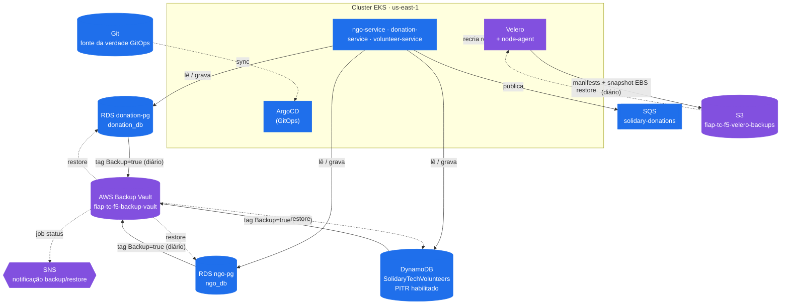

# 🛡️ Disaster Recovery Plan (DRP) — Solidary Tech

> Referência: [`README.md`](../../README.md) do projeto (SRE & Resiliência) — define `donation-service` como o **Foco Principal** de resiliência da plataforma ("Hot Path" da aplicação).

## Resumo Executivo — Plano de Continuidade de Negócios (PCN)

> Esta seção traduz o restante do documento (técnico, a partir da seção 1) pra quem decide orçamento e prioridade — não pra quem opera o sistema. É o mesmo conteúdo que sustenta o Pitch Executivo da entrega ("vendendo a viabilidade pra diretoria da ONG"). Cada número aqui tem a evidência técnica correspondente nas seções abaixo.

**O que está em jogo.** A SolidaryTech existe pra conectar doadores, ONGs e voluntários — o `donation-service` é o caminho pelo qual uma doação em andamento vira ajuda de verdade. Sem um plano de continuidade, um incidente de nuvem não é só "o site caiu": é um doador que desiste de tentar de novo e uma ONG que não recebe o recurso na hora em que precisa.

**O compromisso que este plano garante:**

| Se isso falhar... | ...a plataforma volta a funcionar em até | ...o dado mais recente que se pode perder é de até |
|---|---|---|
| Banco de doações (`donation_db`, Tier 0) | **~20–30 minutos** | **~5 minutos** |
| Cadastro de ONGs / voluntários (Tier 1) | ~20–30 minutos | ~1–5 minutos |
| Cluster inteiro perdido (cenário mais grave) | **~40 minutos – 1h10** | Até 24h só pro que não está versionado no Git (config de runtime) — o resto (código, infra) volta a 0 |

**Isso cabe no que a plataforma promete contratualmente às ONGs parceiras.** O SLA formal do `donation-service` ([`sli-slo-sla.md`](../../../fiap-tech-challenge-fase-5-observability/docs/sli-slo-sla.md)) é **99,5% de disponibilidade mensal** — um orçamento de ~216 minutos (3h36min) de indisponibilidade tolerada por mês antes de caracterizar quebra de contrato. Nessa régua:
- Um incidente isolado de banco de dados, restaurado em 20–30 min, consome **9–14%** desse orçamento mensal.
- Um incidente de cluster inteiro (pior cenário, ~40min–1h10) consome **~19–32%** — ainda dentro do limite, mas é o cenário que mais aperta a margem; mais de 2-3 desses no mesmo mês estouraria o SLA.

**Onde o investimento em resiliência foi priorizado, e por quê.** Nem todo componente recebeu o mesmo nível de proteção — de propósito. `donation-service` (Tier 0) é o único com PITR por segundo, fila SQS dedicada e o RTO mais agressivo do plano, porque é o único cenário em que uma falha pode significar uma doação **em trânsito** perdida de verdade, não só um cadastro que se refaz depois. `ngo-service`/`volunteer-service` (Tier 1) têm proteção equivalente em backup, mas prioridade menor de atendimento — a classificação completa está na seção 3.

**Impacto no negócio se o plano falhar (Business Impact Analysis).** A plataforma ainda não opera com tráfego real de produção (ver `CLAUDE.md` na raiz do monorepo) — não há como quantificar hoje "quantas doações por hora seriam represadas" sem inventar um número. As três dimensões que orientaram onde investir, mesmo sem esse dado:
1. **Continuidade da doação em andamento** — o único cenário com perda potencialmente irrecuperável (transação em voo no momento da queda). Motivo direto do RTO/RPO mais agressivo em Tier 0.
2. **Confiança das ONGs parceiras** — indisponibilidade recorrente ou mal comunicada corrói a credibilidade da plataforma junto a quem depende dela pra operar; ver o plano de comunicação a stakeholders em [`itsm-aiops.md`](../../../fiap-tech-challenge-fase-5-observability/docs/itsm-aiops.md#5-comunicação-aos-stakeholders).
3. **Obrigação contratual (SLA)** — o SLA é o piso abaixo do qual a indisponibilidade deixa de ser "problema técnico" e vira "descumprimento de compromisso externo" com as ONGs.

Assim que houver tráfego real, o próximo passo natural é quantificar o item 1 em volume/hora — hoje seria um número inventado, não uma medição (mesma honestidade do restante deste documento, ver seção 9).

## 1. Objetivo e escopo

Este documento descreve como a Solidary Tech se recupera de perda ou corrupção de dados e de indisponibilidade do cluster, cobrindo os três microsserviços (`ngo-service`, `donation-service`, `volunteer-service`) e a infraestrutura que os sustenta (RDS, DynamoDB, SQS, EKS).

Duas camadas de proteção compõem o plano:

| Camada | Cobre | Mecanismo |
|---|---|---|
| **Dados gerenciados AWS** | RDS (`donation_db`, `ngo_db`), DynamoDB (`SolidaryTechVolunteers`) | Backup automático nativo + AWS Backup ([`module.backup`](../../iac/terraform/modules/backup)) |
| **Cluster Kubernetes** | Manifests, volumes (EBS), estado do EKS | Velero ([`module.velero`](../../iac/terraform/modules/velero)) + GitOps (ArgoCD) |

`SQS` não entra na camada de backup: filas são efêmeras por natureza (a doação já está persistida em `donation_db` antes do evento ser publicado) e a AWS já replica as mensagens entre AZs automaticamente dentro do período de retenção.

## 2. Limitações da conta de estudo (AWS Academy Learner Lab)

Este DRP foi desenhado para ser **implementável de verdade** na conta usada pelo projeto, não um documento aspiracional. Por isso, alguns padrões de DR "de livro" ficam fora do escopo implementado — documentados aqui como arquitetura-alvo para uma conta de produção real, não como pendência técnica:

| Prática comum de DR | Por que não entra | Como o DRP compensa |
|---|---|---|
| Cópia de backup cross-region | Conta Academy libera só uma região | Retenção mais longa (7 dias) na região única + PITR nativo |
| Standby em outra conta/Organization | Sem acesso a AWS Organizations | N/A nesta fase — mitigado por IaC 100% reproduzível (rebuild rápido) |
| IAM role dedicada para AWS Backup/Velero (IRSA) | Conta não permite criar roles/policies IAM | Reuso da `LabRole` já usada pelo `module.eks` (mesmo padrão em `data.tf` dos módulos `backup` e implícito no `velero`) |
| AWS Backup Vault Lock (WORM) | Exige permissão que a conta não concede | N/A nesta fase |
| Budgets/alertas de custo (FinOps) | Console de Billing bloqueado no Academy | Fora do escopo deste DRP — tratado à parte |

## 3. Classificação de criticidade

| Tier | Componentes | Justificativa |
|---|---|---|
| **Tier 0 — Crítico** | `donation-service`, RDS `donation_db` | Marcado explicitamente como "Foco Principal" / Hot Path no README oficial do projeto |
| **Tier 1 — Essencial** | `ngo-service` (RDS `ngo_db`), `volunteer-service` (DynamoDB `SolidaryTechVolunteers`) | Suportam o fluxo, mas uma indisponibilidade pontual não impede uma doação já em andamento |

## 4. RTO / RPO por componente

| Componente | Mecanismo de proteção | RPO | RTO estimado |
|---|---|---|---|
| RDS `donation_db` (Tier 0) | Backup automático nativo (retenção 7 dias, PITR por segundo) + AWS Backup diário | **~5 min** (PITR nativo) | **~20–30 min** (restore de snapshot/PITR + repoint de `DATABASE_URL`) |
| RDS `ngo_db` (Tier 1) | Idêntico ao acima | ~5 min | ~20–30 min |
| DynamoDB `SolidaryTechVolunteers` (Tier 1) | PITR nativo (contínuo, até 35 dias) + AWS Backup diário | **~1 min** (PITR nativo) | **~15–20 min** (restore cria tabela nova + repoint de `AWS_DYNAMODB_TABLE`) |
| Cluster EKS (todos os tiers) | Rebuild via Terraform ([`scripts/`](../../scripts)) + ArgoCD sync + Velero (manifests/volumes) | ~24h (agendamento diário do Velero) para estado fora do Git; **~0** para o que já está no Git | **~40 min – 1h10** (`scripts/run-all.sh` cobre init→plan→apply→kubeconfig; ArgoCD sync + `velero restore` ainda manuais)[^scripts] |
| SQS `solidary-donations` | Nenhum (efêmera) | N/A — dado já está no RDS antes de publicar | N/A |

> RPO "nativo" (PITR) é o caminho rápido para o cenário mais comum — erro de aplicação/operador que corrompe dados minutos atrás. O AWS Backup existe para o cenário de retenção mais longa e para centralizar auditoria/alerta de jobs.

> **Amarração com o SLA**: os RTOs acima cabem no orçamento de indisponibilidade mensal que o SLA formal promete às ONGs parceiras (99,5% pro `donation-service`, 99% pros Tier 1 — ver [`sli-slo-sla.md`](../../../fiap-tech-challenge-fase-5-observability/docs/sli-slo-sla.md)). Conta e contexto de negócio no Resumo Executivo, no topo deste documento.

[^scripts]: Estimativa revisada para baixo (de ~45min–1h20) depois de `scripts/00` a `scripts/08` (ver seção 6) substituírem os comandos `terraform`/`aws eks update-kubeconfig` digitados na mão por passos versionados com confirmação interativa antes de `apply`/`destroy`. O ganho é só na variância de execução humana (menos erro de flag/comando esquecido sob pressão) — o piso do intervalo continua dominado pelo tempo de provisionamento do lado da AWS (control plane do EKS, node group, releases Helm de ArgoCD/Velero), que os scripts não aceleram. Número ainda **estimado, não medido** — precisa de um drill real (seção 9) pra confirmar.

## 5. Arquitetura do processo

Linhas sólidas = fluxo normal (escrita/backup). Linhas tracejadas = fluxo de restore, acionado manualmente seguindo os runbooks da seção 7.

## 6. Componentes de proteção

### AWS Backup ([`module.backup`](../../iac/terraform/modules/backup))

O módulo provisiona duas responsabilidades distintas — separadas aqui só porque as duas são "onde os backups ficam guardados", mas são independentes uma da outra:

**Proteção de RDS e DynamoDB**

1. **Cofre** (`aws_backup_vault`, `fiap-tc-f5-backup-vault`) — contêiner lógico na AWS onde ficam os recovery points.
2. **Plano** (`aws_backup_plan`) — a regra "todo dia às 03:00 BRT (`cron(0 6 * * ? *)`), tira um recovery point e guarda por 7 dias" (`retention_days`).
3. **Seleção por tag**, não por ARN fixo (`aws_backup_selection`, tag `Backup = "true"`) — em vez de listar "faça backup do RDS X, do RDS Y, da tabela Z" um por um, a regra é "faça backup de qualquer recurso com essa tag". Ela já foi aplicada em `modules/rds/main.tf` e `modules/dynamodb/main.tf`, então `donation_db`, `ngo_db` e `SolidaryTechVolunteers` entram automaticamente — e qualquer recurso novo que nascer com essa tag entra também, sem editar o módulo `backup`.
4. **Tópico SNS + assinatura por e-mail** — se um job de backup ou restore falhar (ou concluir), a AWS notifica. Só dispara se `backup_notification_email` estiver preenchido no `tfvars` (hoje vazio por padrão).
5. **Role de serviço**: AWS Backup precisa de permissão para acessar RDS/DynamoDB em seu nome. Como a conta Academy não permite criar role/policy IAM nova, o módulo reaproveita a `LabRole` já existente — a mesma role usada pelo node group do `module.eks` (ver `data.tf`), em vez de criar uma role própria.

**Armazenamento para o Velero**

6. **Bucket S3** (`fiap-tc-f5-velero-backups`), com versionamento, bloqueio de acesso público e expiração automática (7 dias). Não guarda nada de RDS/DynamoDB — é exclusivamente o destino dos backups do cluster Kubernetes que o Velero (abaixo) envia.

Resultado prático: depois do `terraform apply`, a plataforma passa a ter cópias diárias recuperáveis do banco de doações, do banco de ONGs e da tabela de voluntários, retidas por 7 dias, com alerta automático se algum job falhar.

### PITR nativo (complementar, não depende do AWS Backup)
- RDS: `backup_retention_period = 7` habilitado em `modules/rds/main.tf` (estava **desabilitado** antes deste DRP — free tier "otimizado" sem proteção nenhuma). Permite restaurar para qualquer segundo dentro da janela de 7 dias, não só para o snapshot diário do AWS Backup.
- DynamoDB: `point_in_time_recovery { enabled = true }` em `modules/dynamodb/main.tf`. Mesma ideia, janela de até 35 dias.

### Velero ([`module.velero`](../../iac/terraform/modules/velero))

Diferente do `module.backup`, este módulo **não cria recursos AWS** — ele instala um programa dentro do próprio cluster Kubernetes via Helm (`helm_release`), o mesmo mecanismo já usado para instalar o ArgoCD em `module.argocd`.

- **Onde guarda os backups**: no bucket S3 criado pelo `module.backup` (por isso `module.velero` depende de `module.backup` em `main.tf`).
- **Como se autentica na AWS**: sem IRSA (não permitido no Academy) — usa a instance profile do node (`LabRole`, a mesma role do node group do `module.eks`) via cadeia padrão de credenciais do SDK AWS, herdada automaticamente pelos pods.
- **Agendamento**: diário, cobrindo todos os namespaces (`velero_included_namespaces`, padrão `["*"]`), retido por `backup_ttl` (padrão 168h = 7 dias).
- **O que inclui no backup**: os manifests do Kubernetes (Deployments, Services, ConfigMaps, Secrets...) e um snapshot dos volumes EBS em uso (`snapshotsEnabled = true`), mais o `node-agent` (`deployNodeAgent = true`) como fallback de backup a nível de arquivo para volumes que não são EBS.

Na prática: se o cluster inteiro for perdido, há duas fontes para reconstruir — o **Git** (que o ArgoCD reaplica sozinho ao ressincronizar) e o **backup do Velero** (o que não está no Git: estado de volumes, secrets gerados em runtime). O runbook [`eks-velero-restore.md`](runbooks/eks-velero-restore.md) detalha esse restore passo a passo.

### Scripts de automação ([`scripts/`](../../scripts))

Complementa os runbooks, não substitui: `scripts/00` a `scripts/08` cobrem o ciclo de vida completo do Terraform — checagem de sessão, bootstrap do backend S3, `init`, `fmt`/`validate`/`tflint`, `test` (mock, sem AWS real), `plan`, `apply`, `aws eks update-kubeconfig` e `destroy` — sempre com confirmação interativa antes de `apply`/`destroy` (dupla confirmação no `destroy`) e sem gravar credencial nenhuma em disco (resolve a sessão da AWS Academy via `aws configure export-credentials` na hora, injetando como `TF_VAR_*`). `run-all.sh <dev|prd>` encadeia tudo numa chamada só.

É o mecanismo que o runbook [`eks-velero-restore.md`](runbooks/eks-velero-restore.md) (Caso B) usa hoje pro passo de reconstrução de infraestrutura, em vez de comandos `terraform` digitados na mão durante o incidente. Ver [`scripts/README.md`](../../scripts/README.md) para o detalhe de cada passo.

## 7. Cenários de desastre e runbooks

| Cenário | Runbook |
|---|---|
| Dado corrompido/perdido em `donation_db` ou `ngo_db` (erro de aplicação, DELETE indevido, etc.) | [`runbooks/rds-restore.md`](runbooks/rds-restore.md) |
| Dado corrompido/perdido em `SolidaryTechVolunteers` | [`runbooks/dynamodb-restore.md`](runbooks/dynamodb-restore.md) |
| Perda de pod/node/namespace ou do cluster EKS inteiro | [`runbooks/eks-velero-restore.md`](runbooks/eks-velero-restore.md) |

## 8. Papéis e responsabilidades

| Papel | Responsabilidade |
|---|---|
| Quem detecta o incidente | Aciona o runbook correspondente e registra horário de início (T0) — usado para calcular o RTO real no drill |
| Quem executa o restore | Segue o runbook passo a passo, sem improviso — qualquer desvio deve ser documentado em `drills/` depois |
| Quem valida pós-restore | Confere os smoke tests do fim de cada runbook antes de declarar o incidente encerrado |

Em um time pequeno (contexto de projeto acadêmico), a mesma pessoa pode acumular os três papéis — mas os registrar separadamente ainda ajuda a auditar o tempo gasto em cada etapa.

## 9. Drills (simulados)

Todo runbook só é confiável depois de testado de verdade. Use o template em [`drills/TEMPLATE.md`](drills/TEMPLATE.md) para registrar cada simulado (o que foi restaurado, RTO real vs. estimado, o que travou).

Cadência recomendada: pelo menos 1 drill por Tier antes de qualquer apresentação/entrega do projeto — não deixar o primeiro teste do runbook ser o incidente real.

O drill do cenário "cluster EKS perdido" é o primeiro que valida de verdade a estimativa revisada da seção 4 (nota de rodapé[^scripts]) — rodar `scripts/run-all.sh` cronometrado do T0 ao `kubectl get nodes` bem-sucedido dá o RTO real da parte de infraestrutura, isolado do tempo de sync do ArgoCD e do `velero restore` (que continuam manuais e devem ser cronometrados à parte).

## 10. Fora de escopo desta fase

- Cross-region / multi-conta (seção 2)
- FinOps (budgets/alertas) — bloqueado pelo console de Billing do Academy
- DR do `evaluation-service`/`analytics-service`/etc. — não existem neste projeto (herança de repositório de fase anterior, já corrigida nos `tfvars`)
